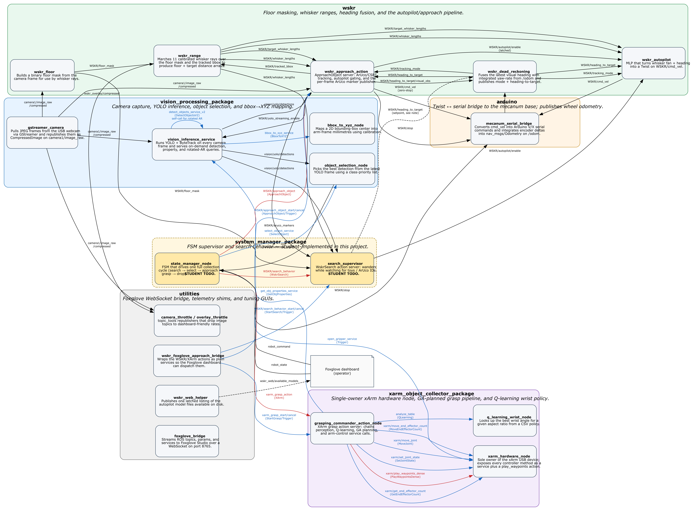

# Project 6 — Hand-Built Robot

A small mecanum-drive robot that searches a floor for toys, drives up to
each one, picks it up with a 5-DoF arm, carries it to an ArUco-marked
drop box, and lets go. Vision, navigation, grasp planning, hardware
control, and high-level orchestration each live in their own ROS 2
package.

This README is the entry point. For long-form setup steps, see:

- [docs/setting_up_local_inference.md](docs/setting_up_local_inference.md) — installing CUDA-enabled YOLO and exporting a TensorRT engine on the Jetson.
- [docs/foxglove_getting_started.md](docs/foxglove_getting_started.md) — getting the dashboard running, both on the Jetson side and on the laptop side.

---

## What this repository does

The collection cycle is broken into five jobs, each owned by a separate
package:

1. **Finite-state machine supervisor** — *new for this project.* The
   `state_manager_node` walks the robot through `SEARCH → SELECT →
   APPROACH_OBJ → GRASP → FIND_BOX → APPROACH_BOX → DROP` and back. The
   companion `search_supervisor` is a `WskrSearch` action server that
   wanders and watches for either a YOLO-recognized toy or an ArUco
   marker. Both nodes are stubbed out in
   [`system_manager_package`](src/system_manager_package/) and are the
   primary deliverable for student teams.
2. **Vision** — [`vision_processing_package`](src/vision_processing_package/)
   captures camera frames over GStreamer, runs YOLO + ByteTrack, picks
   the best detection by class priority, and converts a chosen bbox into
   arm-frame millimetres.
3. **Approach / navigation** — [`wskr`](src/wskr/) builds a floor mask,
   ray-casts 11 "whisker" distances from the robot's feet, fuses a
   target heading from vision plus odometry, and feeds an MLP autopilot
   that publishes `cmd_vel`. The `wskr_approach_action` server tracks a
   single object (CSRT for toys, ArUco for the box) until the
   target-whisker distance drops below the success threshold.
4. **Arduino communication** — [`arduino`](src/arduino/) is a thin
   `Twist`↔serial bridge that talks to the on-board mecanum controller
   and republishes wheel-encoder odometry on `/odom`.
5. **Grasping** — [`xarm_object_collector_package`](src/xarm_object_collector_package/)
   exposes every `XARMController` method as a service through
   `xarm_hardware_node` (so only one process touches the USB device),
   plans grasp trajectories with a genetic algorithm, and looks up wrist
   angles from a Q-learning table.

Custom ROS interfaces (messages, services, actions) all live in
[`robot_interfaces`](src/robot_interfaces/). Diagnostic and dashboard
shims are in [`utilities`](src/utilities/).

---

## Architecture map



Edge legend: **black = topic**, **red = action**, **blue = service**.
Each node box carries a one-sentence summary of what it does; the
diagram groups nodes by package.

---

## Setup

The dependencies you need are the same ones from prior projects plus
the YOLO/TensorRT stack covered in
[docs/setting_up_local_inference.md](docs/setting_up_local_inference.md).
If your Jetson is already set up from earlier projects and the local
inference guide, you should be good to go.

If something looks missing, run the safety-net pip file:

```bash
pip install -r requirements_jetson.txt
```

It only installs packages that are pip-safe; the items that need
special handling (GPU PyTorch, ultralytics with `--no-deps`, system apt
packages) are documented in the file's manual-install block and in
the local inference guide.

Build the workspace the usual way:

```bash
cd ~/Project6_Class_Distro
colcon build --symlink-install
source install/setup.bash
```

---

## Things you have to do before anything will run

### 1. Drop in your own calibration / trained files

Anywhere in the repo a file starts with `your_***`, that's a placeholder
for something you trained or calibrated yourself. Replace each one with
your team's version (keeping the filename) before launching:

| File | What it is |
|---|---|
| `src/wskr/config/your_floor_params.yaml` | floor-mask tuning parameters |
| `src/wskr/config/your_lens_params.yaml` | fisheye lens model |
| `src/wskr/config/your_Whisker_Calibration.json` | per-whisker pixel→mm splines |
| `src/wskr/wskr/models/your_MLP_model_here.json` | trained autopilot MLP |
| `src/vision_processing_package/models/your_vision_model_here.pt` | your YOLO weights (export to `.engine` per the inference doc) |
| `src/xarm_object_collector_package/data/your_q_table_here.csv` | Q-learning wrist-angle policy |

### 2. Implement your FSM and search behavior

The two student-owned files are stubs that import all the right ROS
interfaces but don't actually transition between states or wander:

- [src/system_manager_package/src/state_manager.py](src/system_manager_package/src/state_manager.py) — FSM supervisor.
- [src/system_manager_package/src/search_supervisor.py](src/system_manager_package/src/search_supervisor.py) — `WskrSearch` action server.

Each file's docstring includes a mini-tutorial covering action-client
patterns, sensor caching, and heading control. Until you fill these in,
`robot_bringup.launch.py` will start everything else but the robot will
sit in `IDLE`.

---

## Running

Three launch files cover everything:

| Launch | What it starts | Notes |
|---|---|---|
| `ros2 launch wskr wskr.launch.py` | Same wskr stack you've used since Project 5: floor + range + autopilot + approach + dead-reckoning, the Arduino bridge, and the vision processing pipeline. | Useful for tuning sensors or the approach-action without the FSM in the loop. |
| `ros2 launch system_manager_package robot_bringup.launch.py` | Full autonomous stack: everything in `wskr.launch.py` plus the xArm hardware node, grasp action server, Q-learning service, search supervisor, and your FSM. | Needs your `state_manager` + `search_supervisor` to be runnable. Dispatch behavior with `ros2 topic pub /robot_command std_msgs/String 'data: search'`. |
| `ros2 launch utilities wskr_foxglove.launch.py` | Foxglove WebSocket bridge + the action-to-service shim + image throttles. | Run in a **separate terminal**. Required for telemetry / teleop, not required for headless operation. |

---

## What changed since Project 5

If you've worked in this codebase before, these are the things most
likely to bite you:

- **All tunable parameters now live in `system_manager_package/constants.py`.** Every node imports its parameter defaults from there. Tuning a single number in one place is now enough to change behavior across the stack. You can still hard-code values in a node's preamble — that won't break anything — but the corresponding entry in `constants.py` becomes dead code as soon as you do.
- **Genetic algorithm.** If you modified the GA in Project 5, paste your version into [`src/xarm_object_collector_package/src/genetic_algorithm.py`](src/xarm_object_collector_package/src/genetic_algorithm.py) below the marker comment. Adapt your hard-coded constants to pull from `constants.py` (or leave them hard-coded — the `GA_*` constants will just become dead code).
- **xArm controller no longer imported as a class.** Every node that used to instantiate `XARMController` directly now talks to a single dedicated `xarm_hardware_node` over services and one action (`xarm/play_waypoints_dense`). This was made necessary because multiple nodes opening the USB device caused conflicts. The new wrapper services match the original method signatures 1:1.
- **The object-collection action server is now provided.** A working version lives at [`src/xarm_object_collector_package/src/Object_collector_action_server.py`](src/xarm_object_collector_package/src/Object_collector_action_server.py). If you want to keep your own version, you have three options:
  1. Edit your action server to call the new `xarm/*` services instead of using the `XARMController` class directly.
  2. Copy your action-server structure on top of the provided one, preserving the new service-call wrappers (functionally identical to option 1).
  3. Disable the dedicated hardware node and let your action server keep importing `XARMController` directly. The surgical edit is in [`xarm_object_collector_ga.launch.py`](src/xarm_object_collector_package/launch/xarm_object_collector_ga.launch.py): comment out the `xarm_hardware,` line inside the `LaunchDescription([...])` return tuple (the in-file comment marks the spot). This works, but any other node in your codebase that tries to command the arm (e.g. a drop-off helper) will fight for USB control.

---

## Repository layout

```
src/
  arduino/                       Twist <-> serial bridge + /odom
  robot_interfaces/              Custom msg/srv/action definitions
  robot_description/             URDF / mesh assets (unused at runtime)
  system_manager_package/        FSM + search supervisor (STUDENT)
  utilities/                     Foxglove bridge, GUIs, action-to-service shims
  vision_processing_package/     Camera + YOLO + selection + bbox->XYZ
  wskr/                          Floor + whisker + autopilot + approach
  xarm_object_collector_package/ Hardware node + grasp pipeline + GA + Q-learning

docs/
  architecture.dot / .png / .svg / .drawio   Package + node map
  foxglove_getting_started.md                 Dashboard setup
  setting_up_local_inference.md               YOLO/TensorRT setup

foxglove_files/                   .foxe extension + dashboard JSON
resources/                        Arduino sketch, Jetson setup notes, xArm assets
requirements_jetson.txt           Pip safety-net for missed deps
```
